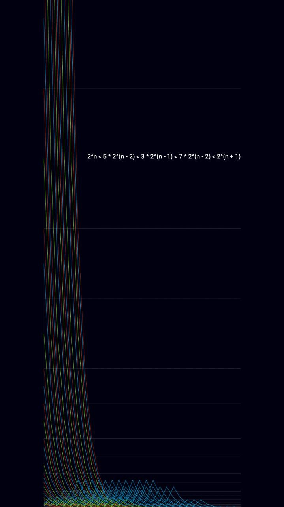

# Single Tree Garden

This project is a sandbox to investigate numeric sequences with Collatz approach  
Right now there are math module and renderer to visualize sequences

Also there are several math-renderer templates you can check



# Voc

### Divisor
```n / 2```

### To-even-normalizer
```n * 3 + 1```

### Stage | Level (basic view)
```2^n < 5 * 2^(n - 2) < 3 * 2^(n - 1) < 7 * 2^(n - 2) < 2^(n + 1)```

#### Trunk 2 | Level bounds | Trunk
```2^n```

#### Trunk 3 | Level center | Trunk's shadow 
```3 * 2^(n - 1)```

#### Level sub center left
```5 * 2^(n - 2)```

#### Level sub center right
```7 * 2^(n - 2)```

### We need to go deeper! There are shoulders of sub centers
```
9 * 2^(n - 3)

11 * 2^(n - 3)

13 * 2^(n - 3)

15 * 2^(n - 3)
```

### Stage | Level (advanced view)
```2^n < (2m + 1) * 2^(n - k) < 2^(n + 1)```